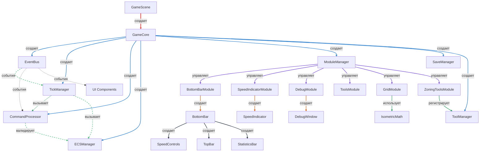
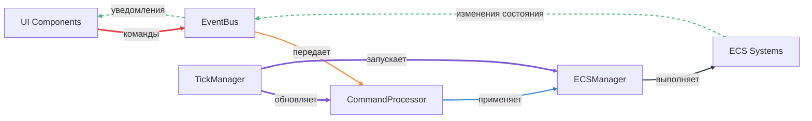
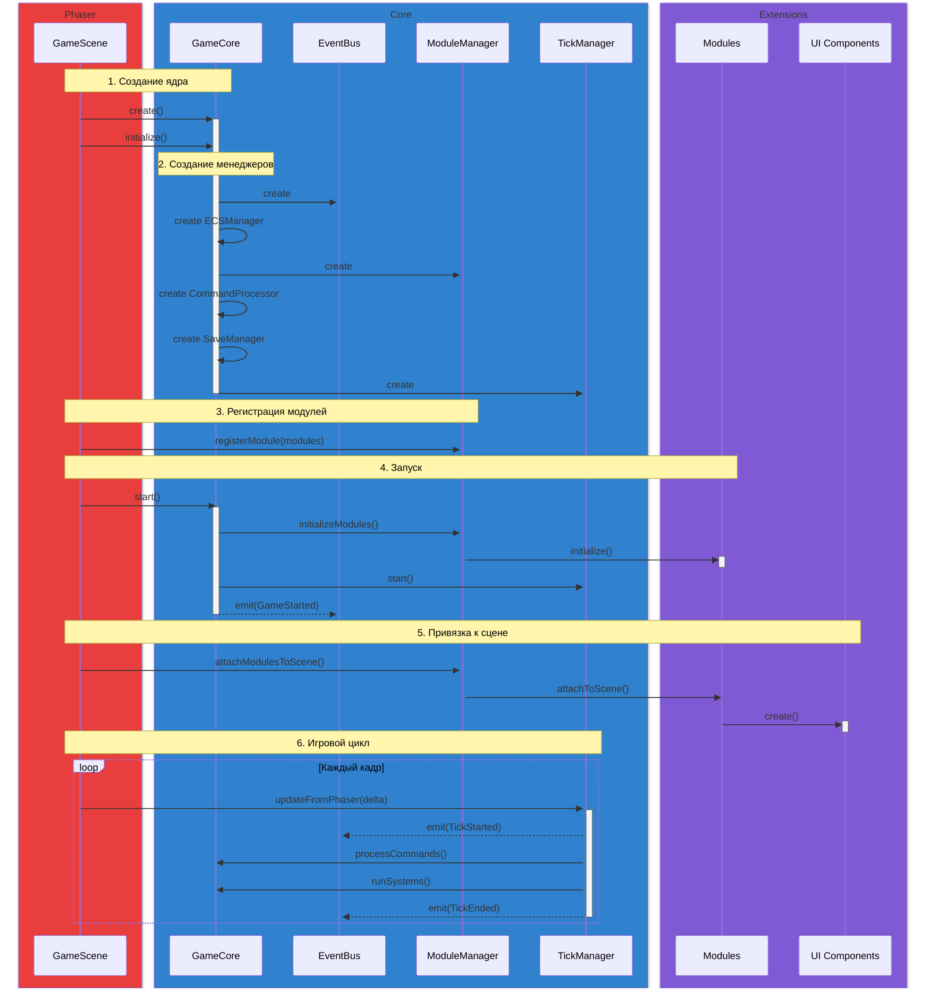
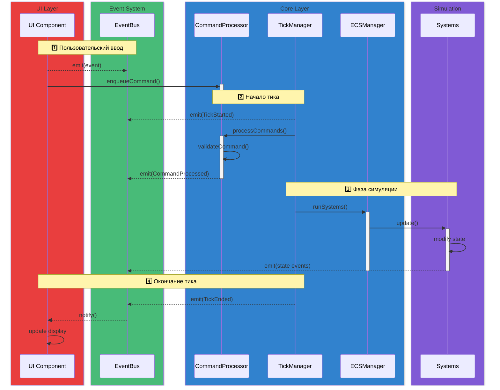

# Таблица взаимодействий компонентов ядра

Этот документ описывает **73 взаимодействия** между компонентами системы Script City MVP. Таблица разделена на несколько секций:

1. **Взаимодействия внутри ядра (1-33)** — взаимодействия между компонентами GameCore
2. **Взаимодействия с Phaser Scene и UI (34-40)** — интеграция с игровым движком
3. **Взаимодействия UI модулей (41-57)** — модули, управляющие жизненным циклом UI
4. **Взаимодействия UI компонентов (58-68)** — визуальные компоненты интерфейса
5. **Взаимодействия инструментов (69-73)** — система инструментов редактора

---

## Взаимодействия внутри ядра

| №   | Источник         | Цель             | Название                      | Описание                                                                                                 |
| --- | ---------------- | ---------------- | ----------------------------- | -------------------------------------------------------------------------------------------------------- |
| 1   | GameCore         | EventBus         | Создание EventBus             | GameCore создает экземпляр EventBus как первый компонент, т.к. другие компоненты могут его использовать  |
| 2   | GameCore         | ECSManager       | Создание ECSManager           | GameCore создает и инициализирует ECSManager для управления игровыми сущностями                          |
| 3   | GameCore         | ModuleManager    | Создание ModuleManager        | GameCore создает ModuleManager для управления модулями игры                                              |
| 4   | GameCore         | CommandProcessor | Создание CommandProcessor     | GameCore создает CommandProcessor, передавая ему EventBus и ECSManager                                   |
| 5   | GameCore         | SaveManager      | Создание SaveManager          | GameCore создает SaveManager и инициализирует его, передавая себя и EventBus                             |
| 6   | GameCore         | TickManager      | Создание TickManager          | GameCore создает TickManager, передавая конфигурацию, EventBus, CommandProcessor и ECSManager            |
| 7   | GameCore         | ModuleManager    | Инициализация модулей         | При запуске GameCore вызывает initializeModules() для загрузки всех зарегистрированных модулей           |
| 8   | GameCore         | TickManager      | Управление циклом             | GameCore запускает/останавливает TickManager через start()/stop()                                        |
| 9   | GameCore         | ECSManager       | Очистка состояния             | При уничтожении GameCore вызывает clear() для очистки всех сущностей                                     |
| 10  | GameCore         | EventBus         | Публикация событий            | GameCore публикует события GameStarted, GameStopped через EventBus                                       |
| 11  | GameCore         | TickManager      | Блокировка скорости           | GameCore может блокировать/разблокировать изменение скорости через lockSpeedChange()/unlockSpeedChange() |
| 12  | TickManager      | EventBus         | Публикация событий тиков      | TickManager публикует события TickStarted, TickEnded при каждом тике                                     |
| 13  | TickManager      | EventBus         | Публикация событий паузы      | TickManager публикует события SimulationPaused, SimulationResumed                                        |
| 14  | TickManager      | EventBus         | Публикация изменения скорости | TickManager публикует событие SpeedChanged при изменении множителя скорости                              |
| 15  | TickManager      | CommandProcessor | Обработка команд              | В начале каждого тика TickManager вызывает processCommands()                                             |
| 16  | TickManager      | ECSManager       | Запуск систем                 | После обработки команд TickManager вызывает runSystems() для выполнения ECS систем                       |
| 17  | CommandProcessor | EventBus         | Подписка на команды           | CommandProcessor подписывается на событие SetSimulationSpeedRequested                                    |
| 18  | CommandProcessor | EventBus         | Публикация результатов        | CommandProcessor публикует события CommandProcessed, CommandRejected, CommandFailed                      |
| 19  | CommandProcessor | EventBus         | Публикация запросов           | CommandProcessor публикует события BuildCommandRequested, ZoneTileRequested и др.                        |
| 20  | CommandProcessor | ECSManager       | Валидация команд              | CommandProcessor использует ECSManager для проверки возможности выполнения команд                        |
| 21  | ModuleManager    | GameCore         | Инициализация модулей         | ModuleManager передает GameCore всем модулям при их инициализации                                        |
| 22  | ModuleManager    | ECSManager       | Регистрация систем            | ModuleManager вызывает registerSystems() у модулей, передавая им ECSManager                              |
| 23  | ECSManager       | EventBus         | Использование в системах      | Системы ECS получают EventBus через runSystems() для публикации событий                                  |
| 24  | SaveManager      | GameCore         | Получение состояния           | SaveManager использует геттеры GameCore для доступа ко всем менеджерам                                   |
| 25  | SaveManager      | TickManager      | Сериализация состояния        | SaveManager вызывает getTickRate(), getCurrentTick(), getSpeed() для сохранения                          |
| 26  | SaveManager      | TickManager      | Десериализация состояния      | SaveManager вызывает setSpeed() для восстановления скорости игры                                         |
| 27  | SaveManager      | ECSManager       | Сериализация ECS              | SaveManager вызывает getAllEntities(), getAllComponentsForEntity() для сохранения                        |
| 28  | SaveManager      | ECSManager       | Десериализация ECS            | SaveManager вызывает clear(), setEntityIdCounter(), addComponent() для восстановления                    |
| 29  | SaveManager      | ModuleManager    | Сериализация модулей          | SaveManager вызывает getAllModules() и serialize() у каждого модуля                                      |
| 30  | SaveManager      | ModuleManager    | Десериализация модулей        | SaveManager вызывает getModule() и deserialize() для восстановления состояния модулей                    |
| 31  | SaveManager      | EventBus         | Доступ через GameCore         | SaveManager получает доступ к EventBus при инициализации для возможной публикации событий                |
| 32  | EventBus         | Все компоненты   | Отправка событий              | EventBus предоставляет механизм emit() для публикации событий всем подписчикам                           |
| 33  | EventBus         | Все компоненты   | Подписка на события           | EventBus предоставляет методы on()/once() для подписки на события                                        |

### Взаимодействия с Phaser Scene и UI

| №   | Источник  | Цель          | Название             | Описание                                                                                 |
| --- | --------- | ------------- | -------------------- | ---------------------------------------------------------------------------------------- |
| 34  | GameScene | GameCore      | Создание ядра        | GameScene создает экземпляр GameCore при запуске сцены                                   |
| 35  | GameScene | GameCore      | Инициализация ядра   | GameScene вызывает initialize() с конфигурацией (tickRate, maxCatchUpTicks, enableDebug) |
| 36  | GameScene | ModuleManager | Регистрация модулей  | GameScene регистрирует модули через moduleManager.registerModule()                       |
| 37  | GameScene | GameCore      | Запуск симуляции     | GameScene вызывает core.start() для запуска игрового цикла                               |
| 38  | GameScene | ModuleManager | Прикрепление модулей | GameScene вызывает attachModulesToScene() для привязки модулей к Phaser сцене            |
| 39  | GameScene | TickManager   | Обновление от Phaser | В методе update() GameScene вызывает tickManager.updateFromPhaser(delta) каждый кадр     |
| 40  | GameScene | GameCore      | Остановка ядра       | При shutdown() GameScene вызывает core.stop() для корректного завершения                 |

### Взаимодействия UI модулей

| №   | Источник             | Цель           | Название                  | Описание                                                                                          |
| --- | -------------------- | -------------- | ------------------------- | ------------------------------------------------------------------------------------------------- |
| 41  | BottomBarModule      | GameCore       | Получение ядра            | BottomBarModule сохраняет ссылку на GameCore при инициализации                                    |
| 42  | BottomBarModule      | BottomBar      | Создание UI компонента    | При attachToScene() создает экземпляр BottomBar (UI компонента)                                   |
| 43  | BottomBarModule      | Phaser.Scene   | Подписка на события сцены | Подписывается на события resize и shutdown для управления жизненным циклом UI                     |
| 44  | SpeedIndicatorModule | GameCore       | Получение ядра            | SpeedIndicatorModule сохраняет ссылку на GameCore при инициализации                               |
| 45  | SpeedIndicatorModule | SpeedIndicator | Создание UI компонента    | При attachToScene() создает экземпляр SpeedIndicator                                              |
| 46  | SpeedIndicatorModule | Phaser.Scene   | Подписка на update        | Подписывается на событие update сцены для обновления индикатора каждый кадр                       |
| 47  | DebugModule          | GameCore       | Получение ядра            | DebugModule сохраняет ссылку на GameCore при инициализации                                        |
| 48  | DebugModule          | DebugWindow    | Создание UI компонента    | При attachToScene() создает экземпляр DebugWindow                                                 |
| 49  | DebugModule          | Phaser.Scene   | Подписка на update        | Подписывается на событие update для обновления отладочной информации                              |
| 50  | ToolsModule          | ToolManager    | Создание ToolManager      | При инициализации создает экземпляр ToolManager                                                   |
| 51  | ToolsModule          | GameCore       | Регистрация ToolManager   | Вызывает core.setToolManager() для доступа к менеджеру инструментов из других компонентов         |
| 52  | ToolsModule          | EventBus       | Передача EventBus         | Передает EventBus из GameCore в ToolManager для работы с событиями                                |
| 53  | GridModule           | GameCore       | Получение EventBus        | GridModule получает EventBus из GameCore при инициализации                                        |
| 54  | GridModule           | IsometricMath  | Создание IsometricMath    | GridModule создает экземпляр IsometricMath для преобразования координат                           |
| 55  | GridModule           | Phaser.Scene   | Создание карты            | При attachToScene() создает контейнер с картой и настраивает управление камерой                   |
| 56  | GridModule           | EventBus       | Публикация событий карты  | Публикует события TileClicked, TileHovered, TileUnhovered, MapCentered, CameraZoomed, CameraMoved |
| 57  | GridModule           | Phaser.Scene   | Обработка ввода           | Подписывается на события ввода (pointermove, pointerout, pointerdown) для взаимодействия с картой |

### Взаимодействия UI компонентов

| №   | Источник      | Цель          | Название                     | Описание                                                                                        |
| --- | ------------- | ------------- | ---------------------------- | ----------------------------------------------------------------------------------------------- |
| 58  | BottomBar     | SpeedControls | Создание компонента          | BottomBar создает экземпляр SpeedControls для управления скоростью игры                         |
| 59  | BottomBar     | TopBar        | Создание панели инструментов | BottomBar создает TopBar для отображения категорий инструментов                                 |
| 60  | BottomBar     | StatisticsBar | Создание панели статистики   | BottomBar создает StatisticsBar для отображения игровой статистики                              |
| 61  | BottomBar     | SaveManager   | Запрос сохранения            | Кнопка сохранения вызывает saveManager.save() для сохранения игры                               |
| 62  | SpeedControls | EventBus      | Подписка на события скорости | Подписывается на SpeedChanged, SpeedChangeLocked, SpeedChangeUnlocked для синхронизации UI      |
| 63  | SpeedControls | EventBus      | Публикация запроса скорости  | Публикует событие SetSimulationSpeedRequested при клике на кнопки скорости                      |
| 64  | SpeedControls | TickManager   | Получение состояния          | Читает текущую скорость и состояние паузы через tickManager.getSpeed() и isActive()             |
| 65  | DebugWindow   | GameCore      | Чтение состояния ядра        | Читает состояние всех менеджеров для отображения отладочной информации                          |
| 66  | DebugWindow   | TickManager   | Чтение метрик тиков          | Получает getCurrentTick(), getGameTime(), getSpeed(), getTicksPerSecond()                       |
| 67  | DebugWindow   | ECSManager    | Чтение состояния ECS         | Получает количество сущностей через getAllEntities().length                                     |
| 68  | DebugWindow   | EventBus      | Чтение истории событий       | Получает историю событий через getEventHistory() и количество подписок через getSubscriptions() |

### Взаимодействия инструментов

| №   | Источник          | Цель             | Название                     | Описание                                                                                             |
| --- | ----------------- | ---------------- | ---------------------------- | ---------------------------------------------------------------------------------------------------- |
| 69  | ToolManager       | EventBus         | Публикация смены инструмента | Публикует событие ToolChanged при активации инструмента                                              |
| 70  | ToolManager       | EventBus         | Подписка на события карты    | Подписывается на TileClicked, TileHovered для передачи активному инструменту                         |
| 71  | ZoningToolsModule | ToolManager      | Регистрация инструментов зон | Регистрирует инструменты зонирования (residential_low, commercial_low, industrial_low) в ToolManager |
| 72  | ZoningToolsModule | CommandProcessor | Создание команд зонирования  | Инструменты зонирования создают ZoneTileCommand и отправляют в CommandProcessor                      |
| 73  | Tool (активный)   | CommandProcessor | Обработка кликов на карте    | Активный инструмент обрабатывает TileClicked и создает соответствующие команды                       |

## Примечания

### Компоненты ядра

- **EventBus** — центральный компонент для асинхронной коммуникации, не имеет прямых зависимостей
- **GameCore** — оркестратор всех компонентов, создает их в правильном порядке и предоставляет публичное API
- **TickManager** — управляет игровым циклом и координирует выполнение систем, интегрирован с Phaser
- **CommandProcessor** — мост между UI и игровой логикой, валидирует и применяет команды
- **ECSManager** — управляет сущностями, компонентами и системами игры
- **ModuleManager** — управляет жизненным циклом модулей, учитывает зависимости
- **SaveManager** — использует все компоненты через GameCore для сохранения/загрузки состояния

### UI и модули

- **GameScene** — главная Phaser сцена, создает и управляет GameCore, регистрирует модули
- **UI модули** (BottomBarModule, SpeedIndicatorModule, DebugModule) — создают UI компоненты и управляют их жизненным циклом
- **UI компоненты** (BottomBar, SpeedControls, DebugWindow) — отображают интерфейс и взаимодействуют с ядром через EventBus
- **ToolsModule** — создает ToolManager и регистрирует его в GameCore для доступа из других модулей
- **ToolManager** — управляет инструментами редактора, передает события карты активному инструменту
- **GridModule** — отрисовывает изометрическую карту, обрабатывает ввод и публикует события взаимодействия с картой
- **IsometricMath** — инфраструктурный компонент для преобразования координат между экранными и тайловыми

### Потоки данных

- **Команды**: UI → EventBus → CommandProcessor → ECSManager/Системы
- **События симуляции**: TickManager → EventBus → UI компоненты
- **События карты**: GridModule → EventBus → ToolManager → Активный инструмент
- **Обновление UI**: Phaser Scene → UI модули → UI компоненты → Чтение состояния из GameCore

## Визуальные схемы архитектуры

### Структура компонентов

### Потоки данных

**Легенда цветов:**

- 🔴 Красный (толстая линия) — создание основных компонентов / входные команды от UI
- 🔵 Синий — создание компонентов ядра
- 🟣 Фиолетовый — управление модулями / обновления от TickManager
- 🟠 Оранжевый — создание UI компонентов / передача команд
- ⚫ Темно-серый — использование инфраструктуры
- 🟢 Зеленый (пунктир) — поток событий через EventBus

### Последовательность инициализации

### Цикл обработки команд

**Цветовая кодировка:**

- 🔴 Красный — Phaser / UI Layer (точка входа)
- 🔵 Синий — Core Layer (ядро системы)
- 🟢 Зеленый — Event System (шина событий)
- 🟣 Фиолетовый — Extensions / Simulation (модули и системы)

**Обозначения стрелок:**

- Сплошная стрелка (`->>`) — прямой вызов метода
- Пунктирная стрелка (`-->>`) — публикация/подписка через EventBus

## Теги

`arch:core`, `arch:documentation`, `arch:schema`
